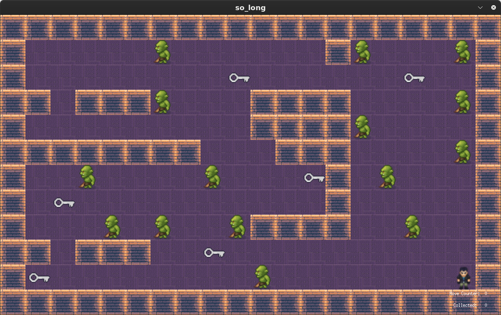

# 🧱 so_long

A 2D dungeon-style maze game built in C using MiniLibX, developed as part of the 42 school curriculum. Navigate through a key-filled labyrinth, avoid enemy patrols, collect the all keys and open the exit gate!
---

## 🎮 Gameplay

You play as a character trapped in a dungeon. Your mission is to **collect all the keys** and **avoid enemies** to reach the exit.



- Keys (C) → Collectibles
- Orcs (Z) → Enemies (contact = game over)
- Brick Walls (1) → Impassable
- Floor (0) → Walkable area
- Exit (E)→ Appears or opens after collecting all keys
- Player (P) -> Player starts from position of P.
---

## ✅ Features

### 🔸 Mandatory

- Valid `.ber` map parsing
- Walls (`1`), floor (`0`), player (`P`), collectible (`C`), exit (`E`)
- Map must be rectangular and fully enclosed (map parsing)
- Valid path check using flood-fill
- Real-time player movement using arrow keys
- Move and collectibles counter in shell

### ⭐ Bonus

- 👾 **Enemies**: Enemies stay stable. Contact = instant game over.
- 🧮 **HUD**: Move counter and collected key tracker on screen.
- 🔁 **Animations**: Player death and orc attack animation.

---

## 🛠 Installation

```bash
git clone https://github.com/hceviz/so_long.git
cd so_long
make [bonus]
```
## 🚀 How to Play
```bash
./so_long maps/map2.ber
```
Move up, down, left, right with arrow keys.

ESC exits game.

## 🧪 Map Format Example (.ber)
```text
1111111111111
10C10000000C1
1000011111001
1P0011E000001
1111111111111
```
1 = Wall \
0 = Floor \
P = Player start \
C = Collectible (Key) \
E = Exit \
Z = Enemy (Bonus part)
